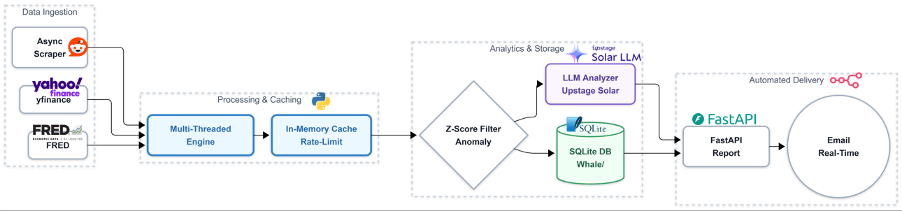
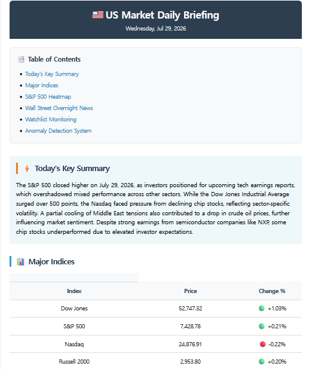
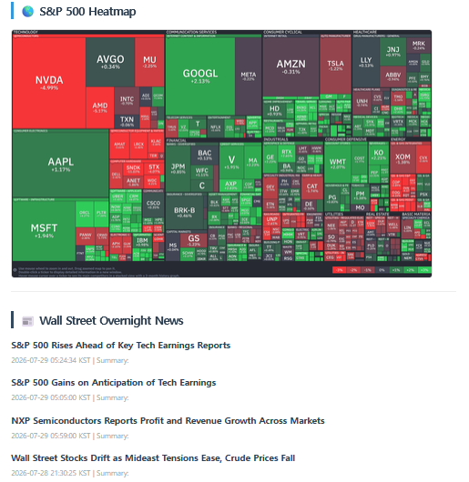
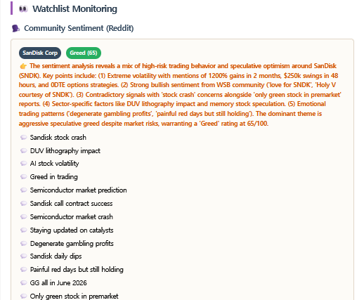
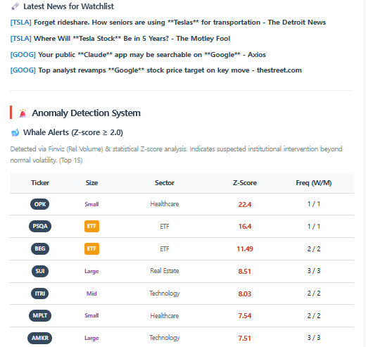
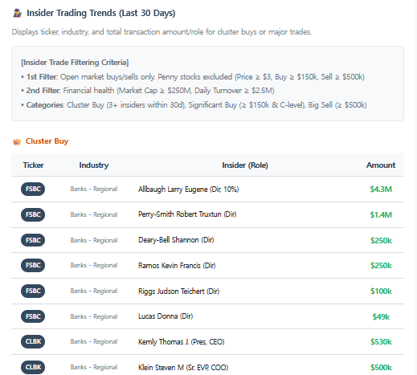
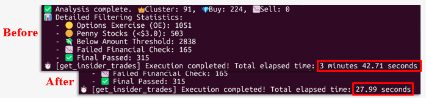

# 📈 FinSight_Agent
> 미국 주식 시장 데이터 수집, 고래 거래 추적 및 데일리 브리핑 자동화를 위한 인텔리전스 에이전트

🌍 **[Read in English](./README.md)**

## ✨ Features

<table>
<tr>
<td width="33%">

### 📊 시장 분석

- 글로벌 지수
- 주요 경제지표
- AI 뉴스 요약
- S&P500 히트맵

</td>

<td width="33%">

### 🎯 관심 종목 분석

- 커뮤니티 투자 심리
- 종목 관련 뉴스
- 핵심 의견 요약

</td>

<td width="33%">

### 🚨 이상 거래 탐지

- 대규모 거래 감지
- 내부자 거래 분석
- AI 리포트 생성

</td>
</tr>
</table>

* **시장 및 거시 경제 지표 모니터링**: FRED API 등을 활용한 주요 경제 지표 자동 추적
* **이상 거래 탐지 (Whale & Insider)**: 고래(대규모 자본) 및 기업 내부자의 거래 내역을 데이터베이스(`whale_tracker.db`)에 축적하고 유의미한 변동성 모니터링
* **뉴스 및 커뮤니티 감성 분석 (Sentiment Analysis)**: 주식 시장 뉴스와 커뮤니티(레딧)를 크롤링하고 LLM을 활용하여 시장 심리를 분석
* **맞춤형 데일리 브리핑**: 수집된 데이터를 바탕으로 HTML 템플릿 기반의 리포트를 자동 생성하여 슬랙 및 이메일로 발송

## 🛠 Tech Stack

**Tech Stack** <br>


**AI & Data** <br>


## 🏗 Architecture Diagram


## 📂 Project Structure
```text
FinSight_Agent/
├── backend/
│   ├── main.py                 # FastAPI 애플리케이션 진입점
│   ├── services/               # 비즈니스 로직 (whale_tracker, insider_tracker 등)
│   ├── templates/              # report_template.html (브리핑 리포트 템플릿)
│   ├── whale_tracker.db        # 로컬 데이터베이스
│   └── docker-compose.yml      # 도커 컨테이너 설정 파일
├── docs/                       # 개발 일지 및 다이어그램 이미지
└── n8n_daily_briefing.json     # 자동화 워크플로우 설정 파일
```

## 🚀 Installation
**1. 저장소 클론**
```bash
git clone [https://github.com/tkdgur7234/finsight_agent.git]
cd finsight_agent/backend 
```
**2. 환경 변수 설정** (.env.example 참고)
```bash
cp .env.example .env  # .env 파일에 FRED_API_KEY, SLACK_WEBHOOK_URL 등을 입력하세요.
```
**3. Docker 통해 백엔드 실행**
```bash
docker-compose up -d --build
```
**4. 서버 실행**
```bash
uvicorn main:app --reload --host 0.0.0
```

## ⚙ Usage
* **API 문서 확인**: 백엔드 서버 실행 후 `http://localhost:8000/docs`에 접속하여 FastAPI Swagger UI를 통해 각 엔드포인트를 테스트할 수 있습니다.
* **n8n 연동**: 제공된 `n8n_daily_briefing.json` 워크플로우를 n8n 환경에 임포트하여 데일리 브리핑 스케줄링을 활성화합니다.


## 🏆 Key Achievements

<table>
<tr>
<td width="33%" valign="top">

### 🚀 Performance

⚡ **90% Faster**

Data Collection

**3 min → 15 sec**

</td>

<td width="33%" valign="top">

### 🤖 Autonomous Agent

시장 데이터를

**수집 → 분석 → 리포트 → 이메일**

까지 자동 수행

</td>

<td width="33%" valign="top">

### 🧠 AI Intelligence

LLM을 활용해

뉴스 요약

투자 심리 분석

시장 해석 제공

</td>
</tr>
<tr>

<td width="33%" valign="top">

### 📊 Quant Analysis

Z-score 기반

이상 거래 탐지

내부자 거래 분석

</td>

<td width="33%" valign="top">

### 🌎 Multi-source

경제지표

뉴스

커뮤니티

시장 데이터

통합 분석

</td>

<td width="33%" valign="top">

### 💡 Efficient Pipeline

중복 제거

시간 필터링

토큰 최적화

고품질 데이터만 분석

</td>
</tr>
</table>

## 📊 Results

### 📈 Daily Market Briefing

주요 지수, 경제지표, AI 뉴스 분석을 종합하여 일일 시장 리포트를 자동 생성합니다.

<p align="center">
  
</p>

---

### 🎯 Watchlist Monitoring

커뮤니티 투자 심리와 종목 뉴스를 기반으로 관심 종목을 심층 분석합니다.

<p align="center">
  
  
</p>

---

### 🚨 Smart Detection

통계 기반 이상 거래와 내부자 거래를 자동으로 탐지하여 제공합니다.

<p align="center">
  
  
</p>


## 💡 Trouble Shooting
  
* **API 병목 현상 개선 및 크롤링 로직 최적화 (멀티스레딩 도입)**
  * **Issue**: 주요 종목의 내부자 거래 모니터링 로직에서 두 가지 문제가 발생했습니다. 첫째, 웹사이트 크롤링 기준을 너무 타이트하게 설정하여 사이트 내에서 데이터가 엉키는 현상이 발생했습니다. 둘째, 필터링된 티커(약 300건)를 `yfinance` 서버와 순차적으로 통신하여 주가 데이터를 가져오다 보니 약 3분 이상의 심각한 성능 병목(Bottleneck)이 발생했습니다.
  * **Solution**: 이를 해결하기 위해 데이터 수집과 처리 방식을 전면 개편했습니다.
    1. **필터링 로직 분리**: 사이트의 검색 기준에 의존하지 않고, 느슨한 기준으로 5,000개의 데이터를 1차 수집한 뒤 파이썬 내부 로직에서 엄격하게(최근 1달 치) 2차 필터링을 수행하여 데이터의 정합성을 확보했습니다.
    2. **멀티스레딩 적용**: 외부 API 통신 시 발생하는 I/O 대기 시간을 줄이기 위해 `ThreadPoolExecutor`를 활용한 멀티스레딩 환경을 구축했습니다.
  * **Result**: 결과적으로 데이터를 안전하게 수집함과 동시에, **기존 3분이 소요되던 작업 시간을 약 15초로 단축(약 90% 성능 향상)** 시키는 극적인 최적화를 이루어냈습니다.
   

* **데이터 소스 의존성 문제 해결 (FMP API → Finviz 크롤링)**
  * **Issue**: '이상 거래 감지' 기능 구현 당시, 초기 데이터 파이프라인 구축 시 `Financial Modeling Prep(FMP) API`를 사용했으나, 해당 서비스의 갑작스러운 정책 변경으로 인해 데이터 수집이 중단되는 문제가 발생했습니다.
  * **Solution**: 외부 API 의존도를 낮추고 서비스 안정성을 확보하기 위해, `Finviz` 웹사이트의 데이터를 자체적으로 크롤링(BeautifulSoup 활용)하여 파싱하는 방식으로 로직을 전면 수정하여 데이터 수집 파이프라인을 정상 복구했습니다.


## 📈 Future Improvements

* **시장 변동성 모니터링 고도화**: 공매도 잔고(Short Interest) 및 숏 스퀴즈 발생 가능성 모니터링 기능 추가
* **개인화 및 수익화 모델**: 사용자별 관심 종목(Watchlist)에 맞게 맞춤형 데이터를 필터링하여 리포팅하는 기능 도입
* **이메일 발송 시스템 안정화**: 현재 구글 앱 비밀번호를 활용한 SMTP 방식에서, 향후 SendGrid나 Mailgun 등의 전문 이메일 서비스 계정을 연동하여 n8n 노드 교체 및 전송 안정성 확보
* **리포트 UI/UX 개선**: 현재 모바일 뷰에 맞춰진 이메일 본문 리포팅 방식을 웹 환경에서도 쾌적하게 볼 수 있도록, 노션이나 별도 웹 링크 형태로 제공하는 브리핑 포맷으로 교체 고려